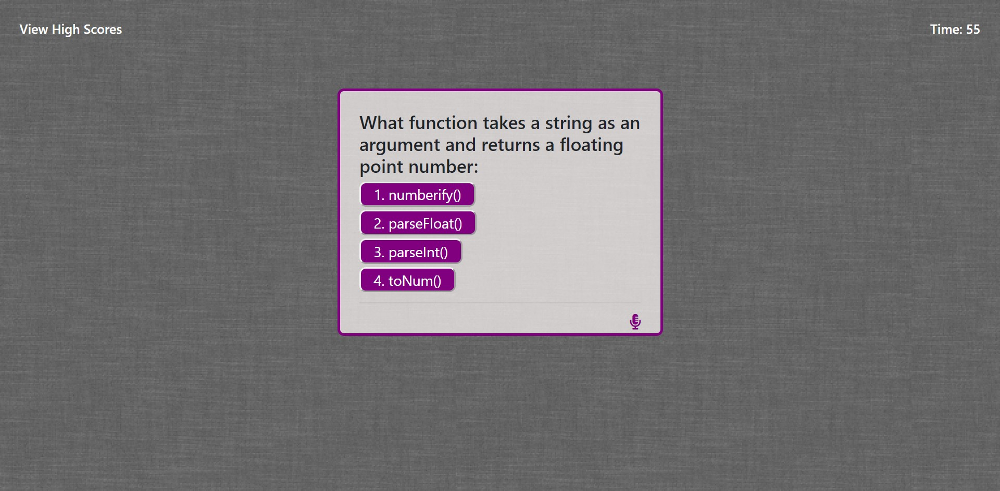
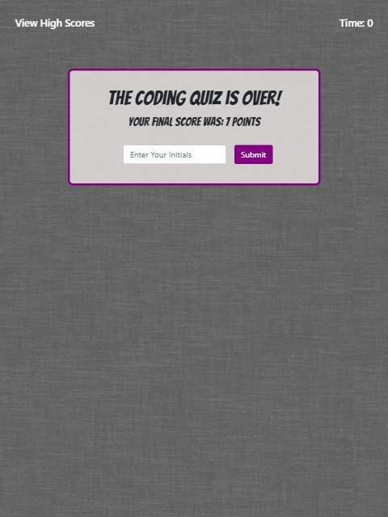
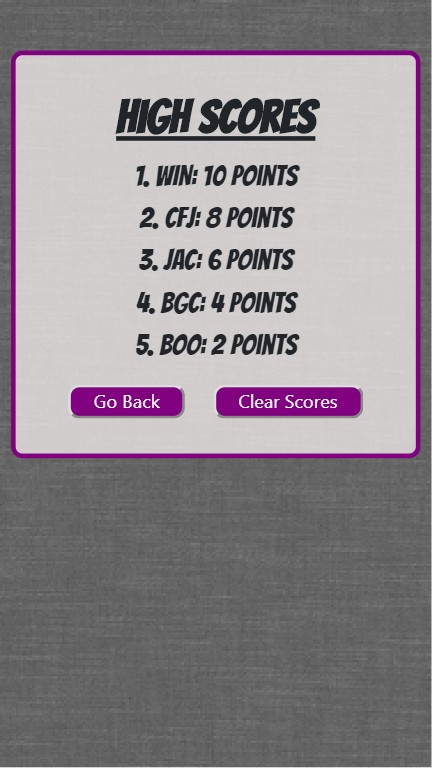

# Code Quiz

## User Story

* This is a timed quiz assessing your knowledge of coding.
* You will have 60 seconds to answer as many multiple choice questions as you can, but for each one you miss, you get a 10 second penalty.
* If you get a question correct, a 'ding' sound plays and a green message saying 'correct!" displays below the question.
* If you get the question wrong, a 'buzz' sound plays and a red message saying 'wrong!' displays.
* There is a microphone icon that toggles the sound off and on and your sound preference is saved in local storage.
* After you finish, you can add your initials to the High Scores list, which is also saved in local storage.

## Built With:

* HTML
* CSS
* Bootstrap framework
* Vanilla Javascript

## Screenshots:

* Laptop Screen

* Ipad Screen

 

* Iphone Screen

## Credits
* The sound effects used were found at http://www.orangefreesounds.com/.
* The main font used is 'Bangers' from https://fonts.google.com/.
* The sound icons were from https://fontawesome.com/.  
  
- - - -
**Check it out here:**  https://alexcoulter.github.io/Code-Quiz/.
- - - -

